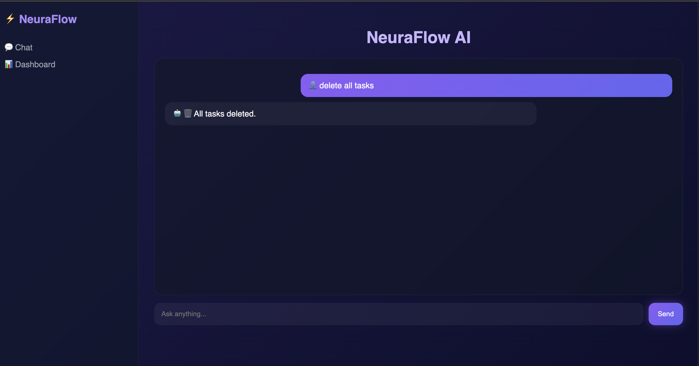
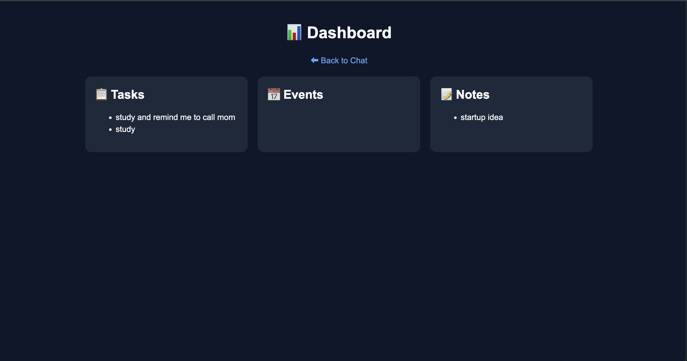

# 🚀 🧠 NeuraFlow AI — Multi-Agent Productivity Assistant

---

## 🌐 Live Demo

https://crypto-agent-843080848499.asia-south1.run.app/

---

## 📦 GitHub Repository

https://github.com/MuskaanTimbadiya/multi-agent

---

## 🧠 Overview

NeuraFlow AI is a **multi-agent AI system** that manages tasks, events, and notes using natural language.

It uses:
- 🧠 LLM-based routing (Gemini)
- 🔗 MCP-style tool integration
- 🗄 SQLite database
- 💬 Chat UI + 📊 Dashboard

---

🧩 Architecture

User (Chat UI)

↓

Main Agent (LLM Router)

↓

┌──────────────┐

│ Task Agent   │

│ Calendar Agent│

│ Notes Agent │

└─────────────┘

↓

Database (SQLite)

↓

Response → UI
---

## 🤖 Features

### ✅ Multi-Agent System
- Main agent coordinates multiple sub-agents  
- Modular and scalable design  

### 🔗 MCP Tool Integration
- Task Manager  
- Calendar / Reminder system  
- Notes Manager  

### 🧠 LLM-Powered Routing
- Gemini selects the appropriate agent dynamically  

### 🔁 Multi-Step Workflows
add task study and remind me to call mom

### 🗄 CRUD + Bulk Operations
- Add / View / Delete  
- Example:delete all events

### 💬 Chat Interface
- ChatGPT-style UI  
- Animations + typing indicator  

### 📊 Dashboard
- Tasks, Events, Notes view  
- 📊 Stats (counts)  
- 🧠 AI Insights  

---

## 🧪 Example Commands

### Tasks
- add task study  
- show tasks  
- delete task study  
- delete all tasks  

### Events
- remind me to call mom  
- schedule meeting  
- delete all events  

### Notes
- save note startup idea  
- show notes  
- delete note startup  

---

## 🛠 Tech Stack

- FastAPI  
- Gemini API  
- SQLite  
- HTML, CSS (Jinja2)  
- Docker + Cloud Run  

---

## 🚀 Getting Started

git clone https://github.com/MuskaanTimbadiya/crypto-agent.git
cd crypto-agent
pip install -r requirements.txt
export GOOGLE_API_KEY="your-api-key"
uvicorn main:app --reload

---

## 📸 Screenshots

### 💬 Chat Interface

### 📊 Dashboard

---

## 🎯 Key Highlights

- Multi-agent orchestration  
- MCP-style architecture  
- LLM-based intelligent routing  
- Multi-step workflow execution  
- Chat UI + Dashboard  

---

## 📌 Future Improvements

- Real-time chat (AJAX)  
- Google Calendar API integration  
- User authentication  
- Memory-aware conversations  

---

## 🙌 Author

**Muskaan Timbadiya**

---

## ⭐ Support

If you like this project, give it a ⭐ on GitHub!
